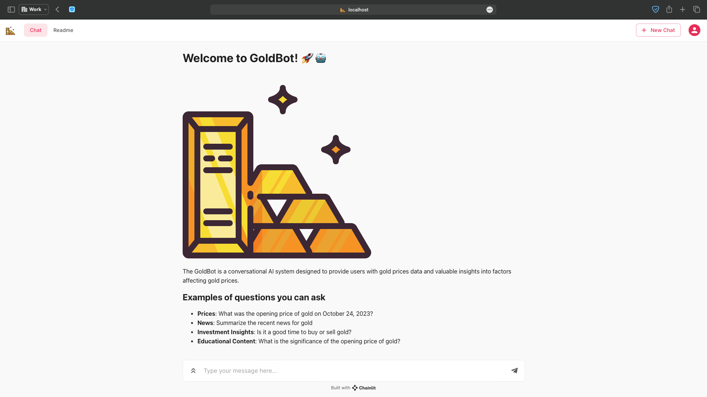
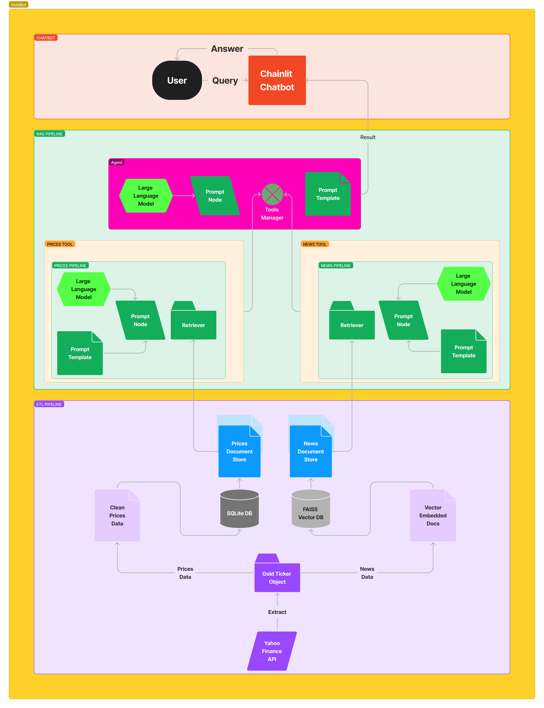

# Hacktoberfest 2023 project: GoldBot (The Gold Price Chatbot with Investment Insights)

## Theme of your project

Retrieval Augmented Generation (RAG) pipeline for chatbot

## Description

GoldBot is a conversational AI system designed to provide users with information about gold prices and valuable insights into factors affecting gold prices. The chatbot will offer educational content and explanations, making it a comprehensive resource for users interested in gold as an investment.

This project is dedicated to building a Retrieval Augmented Generation (RAG) pipeline for the Gold Price Chatbot with Investment Insights. The primary goal is to enhance the chatbot's capability to provide users with accurate and informative responses related to gold prices and investment insights.

## Data sources

We will exclusively utilize open-source data sources for this project. Our primary data source will be Yahoo Finance. This data will serve as the foundation for our chatbot's knowledge base, enabling it to provide accurate and up-to-date information about gold prices and related factors.

## Methods

To achieve the project's goals, we will focus on implementing the RAG (Retrieval Augmented Generation) pipeline. The tools we will use include Python, SQLite and FAISS Vector DB for data storage, Haystack for orchestration, and Chainlit for building the user interface. The RAG pipeline will enhance the chatbot's ability to retrieve relevant information and generate insightful responses to user queries.

- **ETL Pipeline**: GoldBot sources and processes both historical gold price data and current textual news about gold from Yahoo Finance daily, ensuring data consistency.

- **RAG Pipeline with Haystack**: The RAG (Retrieval Augmented Generation) pipeline powered by Haystack handles queries using language models and retrievers.

- **Haystack Agent**: An agent orchestrates tools based on user queries, choosing between price-related and news-related information.

- **Chainlit Chatbot Interface**: Users interact with the Haystack agent for answers.

## User interface

The user interface for our chatbot will be developed using Chainlit. Chainlit offers a user-friendly and interactive interface that allows users to interact with the chatbot seamlessly. It will provide an intuitive way for users to inquire about gold prices, investment advice, and educational content related to gold as an investment.

## System Design

## Team members

1. Rajat Jain 
2. Roshawn Brooks 
